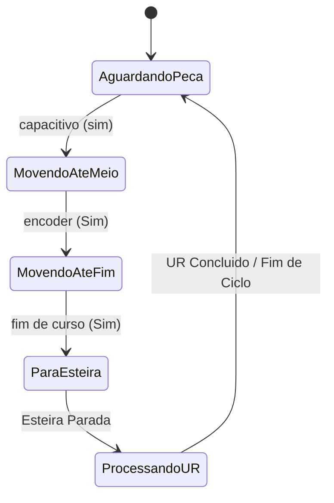

## Operação da esteira

Este repositorio visa impementar a operação a esteira usando uma maquina de estdos 

### sensores
1. capacitivo /indutivo(alto)
2. encoder(alto)
3. proximidade(alto)
4. fim de curso(alto)
5. fim de curso baixo(baixo)

### estados

1. *aguardando* nesse estado a esteira aguarda peça
2. *aceleração da esteira* o motor  começa a acelerar
3. *velociidade de cruzeiro* o motor mantemm velocidade constante até
até o nivel alto do sensor.
4. *desaceleração da esteira* motor commeça a desacelerar até parar
5. *aguarda UR* sensor de  fim de curso em nivel alto. 

