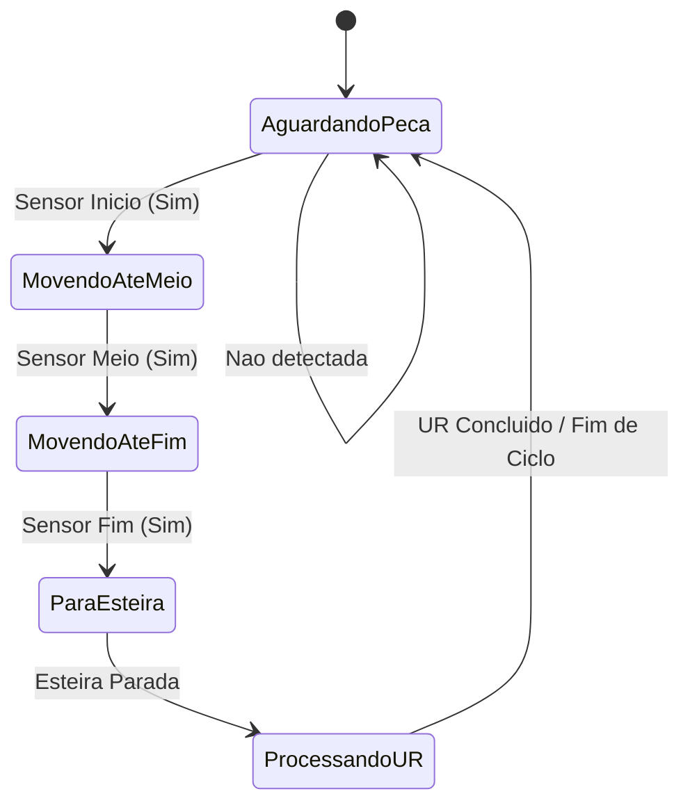

## Operação da esteira

Este repositorio visa impementar a operação a esteira usando uma maquina de estdos 

```mermaid
   stateDiagram-v2
    [*] --> AguardandoPeca

    AguardandoPeca --> AguardandoPeca: Nao detectada
    AguardandoPeca --> MovendoAteMeio: Sensor Inicio (Sim)

    MovendoAteMeio --> MovendoAteFim: Sensor Meio (Sim)

    MovendoAteFim --> ParaEsteira: Sensor Fim (Sim)

    ParaEsteira --> ProcessandoUR: Esteira Parada
    
    ProcessandoUR --> AguardandoPeca: UR Concluido / Fim de Ciclo 
```